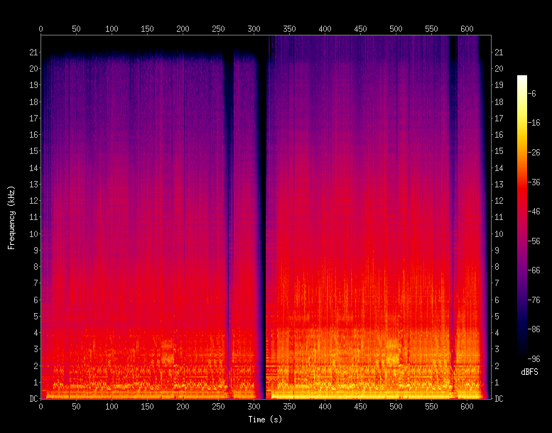
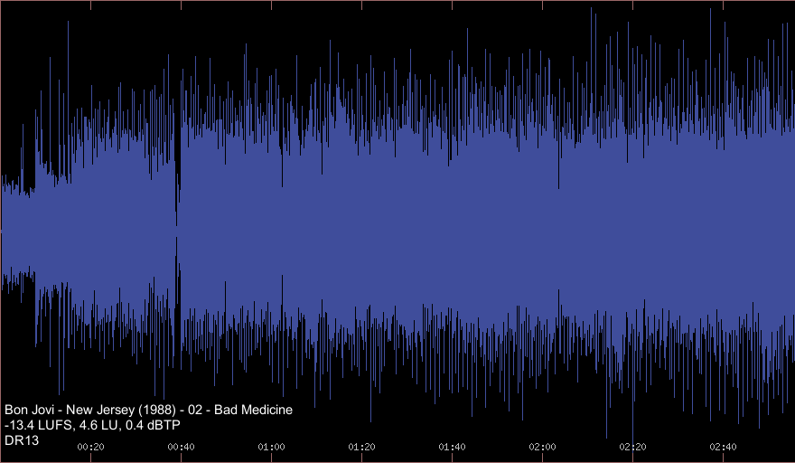
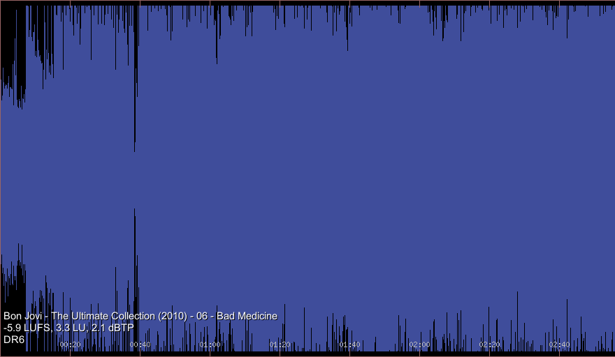

# Audio Quality Analyze Tools

>"If you have good loudspeakers, and you hear something you don't like, you know the problem is in the recording."
> 
> <cite>-- [Floyd Toole, consultant to Harman, 16. Apr. 2016](https://youtu.be/zrpUDuUtxPM?t=4182)</cite>

 - But it is possible to identify a low-quality song without having to listen to it first? Is the newer, remastered album even worth listening to?
 - Do your new speakers sound distorted, maybe even worse than the old ones? Is it the speakers, or lousy mastering of your favourite music?
 - Have you ever tried to get rid of a sound resonance, by switching cables, players, speakers, fixing furniture... just to find out that the problem is in the recording?

In any case, it's a good idea to make sure that your audio collection is not the problem. Especially before you start buying new equipment, speakers, headphones...
There is a lot of theory out there. Subjective opinions, music industry myths, a lot of confusion scattered all over the forums.

... so how can you find out what recordings have the potential to sound good?

---
## About

These Linux tools will help you to get a better understanding of your music collection and the quality of locally stored audio. You can visually compare different songs and album releases, easily identify common cases of audio abuse, like dynamic range compression, limiting and clipping. The results can create a base for reviews of released albums from the audio quality perspective.

### audioview
shows a simplified waveform, in 200ms per pixel constant time resolution, of a given 16bit/44.1kHz single audio file (WAV, FLAC, MP3, OGG). Additional information about the audio quality is displayed as an overlay. It is meant to be associated with audio files in a file manager, in an audio player, or run directly from the terminal.

Displayed metadata overlay is in the form of:

 * Artist - Album (Year) - TrackNr - Title
 * Loudness [LUFS], Loudness Range [LU], True Peak [dBTP] (see [aq-loudness](#aq-loudness))
 * [Dynamic Range Value](http://dr.loudness-war.info)
 * Bitrate for lossy compression format files (MP3, OGG)

It is a wrapper around [audiowaveform](https://github.com/bbc/audiowaveform), [exiftool](https://en.wikipedia.org/wiki/ExifTool), [feh](https://feh.finalrewind.org) and [vorbis-tools](https://wiki.xiph.org/Vorbis-tools) (for optional OGG support). In addition to standard TAG metadata, it displays the results generated by [dr14.tmeter](https://github.com/simon-r/dr14_t.meter) and the [aq-loudness](#aq-loudness) script.
Audioview uses _loudness.txt_ file to display the loudness information, and _dr14.txt_ or _foo_dr.txt_ to display the DR value. These files can be saved in the same directory as the viewed file or in a subdirectory, _audioview_ will find them. To speed up repeated view, it maintains a local cache in _$HOME/.cache/audioview_.
In case of an error there is no visual notification, an error message might appear on the terminal.

### aq-loudness
generates [EBU-R128](https://tech.ebu.ch/loudness) loudness report for all audio files in current directory and saves it to _loudness.txt_ file. This is later used by audioview to display loudness metadata in the overlay. It is meant to be run from the terminal. The output formatting is made to look similar to a DR14 report file.

The results contain:

 * LUFS (Loudness Units Full Scale) - Absolute Loudness Level, as defined by the [EBU Tech spec 3341](https://tech.ebu.ch/publications/tech3341). The [recommended value](https://youtu.be/BhA7Vy3OPbc?t=2213) for production is around -16 LUFS or less, but a higher value does not necessarily indicate distortion.
 * LU (Loudness Units) - Loudness Range, as defined by the [EBU Tech spec 3342](https://tech.ebu.ch/publications/tech3342)
 * dBTP - True Peak Level value in dB. This should always be less than 0, a positive value indicates [clipping distortion](https://youtu.be/BhA7Vy3OPbc?t=159) due to not enough headroom. NOTE: This one is CPU heavy to calculate. 

It is a wrapper around [loudness-scanner](https://github.com/jiixyj/loudness-scanner). For more on loudness and the EBU-R128 parameters, see: https://www.youtube.com/watch?v=iuEtQqC-Sqo

### aq-spectrogram
generates a single spectrogram, for all _flac_ files in current directory combined. The the color map resolution is 96dB to represent the full scale of 16 bit audio.  The time resolution is constant; 1s of audio per pixel on the X axis. The Y axis shows frequency up to 22 kHz to match the [CD sampling rate](https://en.wikipedia.org/wiki/Compact_Disc_Digital_Audio#Sample_rate).

NOTE1: this is VERY slow! It is much faster to identify low-quality recordings by a quick look at [audioview](#audioview-1).

NOTE2: frequency on the Y axis is in linear scale, not logarithmic! This way the spectrogram does not resemble what we hear, but helps to identify high frequency issues like aliasing.

This script is a simple wrapper for [sox](http://sox.sourceforge.net).

---
## Installation

These tools are simple BASH scripts, just place or link them into your $PATH directory, an install the dependencies:

### Debian

    # apt-get install imagemagick libimage-exiftool-perl feh vorbis-tools sox tofrodos bc sed libebur128-dev

The _audiowaveform_, _dr14.tmeter_ (GPLv3) and _loudness-scanner_ (MIT) are open source tools, but unfortunately missing from the Debian repositories (Debian Testing, as of 2017-01). For audiowaveform, there is an Ubuntu Launchpad PPA. For dr14.tmeter, there are packages available for all major Linux systems. The loudness-scanner has to be compiled from source, even though the _libebur128-dev_ is available from the repository.

**audiowaveform**:

follow instructions here: https://github.com/bbc/audiowaveform#installation

**dr14.tmeter**:

follow instructions here: http://dr14tmeter.sourceforge.net/index.php/Main_Page

**loudness-scanner**:

official instructions: https://github.com/jiixyj/loudness-scanner#installation

NOTE: On Debian Testing the compilation fails due to incompatible libinput_ffmpeg code. Running ```make install``` is not recommended - it fails to install the _loudness_ binaries, and also could break _ffmpeg_ by installing local version of libebur128.

The workaround is to disable the ffmpeg input, compile, and then copy the binaries manually. This worked on Debian:

    $ mkdir build; cd build
    $ cmake -DDISABLE_FFMPEG:BOOL=yes ..
    $ make
    $ sudo cp loudness* /usr/local/bin/
    $ sudo cp libinput_* /usr/lib/


---
## Usage


### aq-loudness

Syntax: ```$ aq-loudness```


### aq-spectrogram

Syntax: ```$ aq-spectrogram```

**Example:**

Running the script in a directory with 2 example files, different versions of the same song (Bon Jovi - Bad Medicine). The first half of the spectrogram shows the version released in 1988: no high frequency issues, all is kept nicely below 21 kHz to avoid aliasing distortion. The second half shows the 2010 remastered version: The high frequencies go all the way to the top during the whole song. This anomaly in the remastered version was caused by careless digital clipping.



### audioview

Syntax:

    $ audioview PATH_TO_YOUR_AUDIOFILE

**Example:**

Show the difference between the original and the remastered release:

    $ audioview "02 - Bad Medicine.flac"
    $ audioview "CD1 - 06 - Bad Medicine.flac"

Original version released in 1988. Beautiful [DR13](http://dr.loudness-war.info/) dynamics, no clipping issues, lively and enjoyable sound:
[  ](https://raw.githubusercontent.com/audioquality/audioview/master/doc/badmedicine1988.png)

The same song, remastered in 2010, dynamically compressed and clipped. This low-quality bricked release sounds in comparison [wimpy, small, distorted](https://youtu.be/u9Fb3rWNWDA?t=859) and boring:
[  ](https://raw.githubusercontent.com/audioquality/audioview/master/doc/badmedicine2010.png)

---
## License

This work is free. You can redistribute it and/or modify it under the
terms of the Do What The Fuck You Want To Public License, Version 2,
as published by Sam Hocevar. See http://www.wtfpl.net for more details.

## Contributing

If you want to report a bug, we'd be happy to hear
from you. Please either [raise an issue](https://github.com/audioquality/audioview/issues), or fork the project and send us a pull request.

## Authors

This software was written by (dev@audioquality.org)

