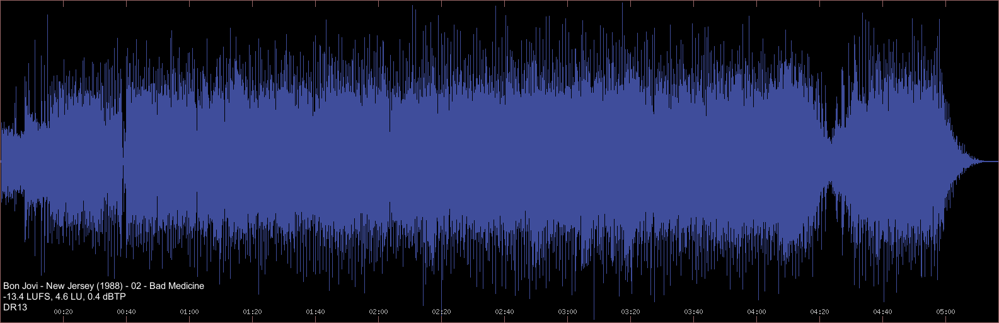
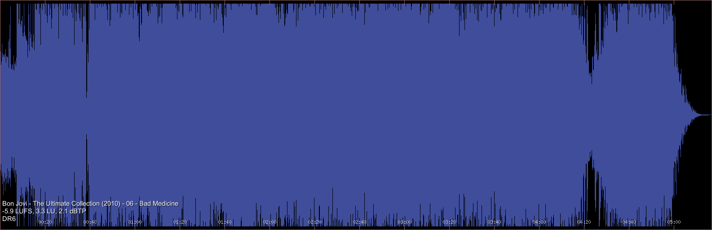

# Audio Quality Analyze Tools

>"If you have good loudspeakers, and you hear something you don't like, you know the problem is in the recording."
> 
> <cite>-- [Floyd Toole, consultant to Harman, 16. Apr. 2016](https://youtu.be/zrpUDuUtxPM?t=4182)</cite>

 - But it is possible to identify a low-quality song without having to listen to it first? Is the newer, remastered album even worth listening to? 
 - Do your new speakers sound distorted, maybe even worse than the old ones? Is it the speakers, or lousy mastering of your favourite music?
 - Have you ever tried to get rid of a sound resonance, by switching cables, players, speakers, fixing furniture... just to find out that the problem is in the recording?

In any case, it's a good idea to make sure that your audio collection is not the problem. Especially before you start buying new equipment, speakers, headphones...
There is a lot of theory out there. Subjective opinions, music industry myths, a lot of confusion scattered all over forums.

... so how can you find out what recordings have the potential to sound good?

---
##About##

These simple Linux tools will help you to get a better unserstanding of your music collection. The goal is to get an quick overview about the quality of a local audio, giving you the ability to visually compare different songs and album releases. It helps to easily identify common cases of audio abuse, like dynamic range compression, limiting and clipping.

###audioview###
shows a simplified waveform, in 200ms per pixel constant time resolution, of a given 16bit/44.1kHz single audio file (WAV, FLAC, MP3, OGG). Additional information about the audio quality is displayed as an overlay. It is meant to be associated with audio files in a file manager, in an audio player, or run directly from the terminal.

Displayed metadata overlay is in the form of:

 * Artist - Album (Year) - Tracknr - Title
 * Loudness [LUFS], Loudness Range [LU], True Peak [dBTP] (see _audioquality-loudness_)
 * [Dynamic Range Value](http://dr.loudness-war.info)
 * Bitrate for lossy compression format files (MP3, OGG)

It is a wrapper around [audiowaveform](https://github.com/bbc/audiowaveform), [exiftool](https://en.wikipedia.org/wiki/ExifTool), [feh](https://feh.finalrewind.org) and [vorbis-tools](https://wiki.xiph.org/Vorbis-tools) (for optional OGG support). In addition to standard TAG metadata, it displays the results generated by [dr14.tmeter](https://github.com/simon-r/dr14_t.meter) and the _audioquality-loudness_ script.
Audioview uses _loudness.txt_ file to display the loudness information, and _dr14.txt_ or _foo_dr.txt_ to display the DR value. These files can be optionally saved in a subdirectory, _audioview_ will find them. To speed up repeated view, it maintains a local picture cache in _$HOME/.cache/audioview_.
In case of an error there is no visual notification, an error message might appear on the terminal.

###audioquality-loudness###
generates [EBU-R128](https://tech.ebu.ch/loudness) loudness report and saves it to _loudness.txt_ file. This is later used by audioview to display loudness metadata in the overlay. It is meant to be run from the terminal, from the directory with audio files to be analyzed (eg. album directory). The output formatting is made to look similar to a DR14 report file.

The results contain:

 * LUFS (Loudness Units Full Scale) - Absolute Loudness Level, as defined by the [EBU Tech spec 3341](https://tech.ebu.ch/publications/tech3341). The [recommended value](https://youtu.be/BhA7Vy3OPbc?t=2213) for production is around -16 LUFS or less, but a higher value does not necessarily indicate distortion.
 * LU (Loudness Units) - Loudness Range, as defined by the [EBU Tech spec 3342](https://tech.ebu.ch/publications/tech3342)
 * dBTP - True Peak Level value in dB. This should always be less than 0, a positive value indicates [distortion](https://youtu.be/BhA7Vy3OPbc?t=159) due to not enough headroom. NOTE: This one is CPU heavy to calculate. 

It is a wrapper around [loudness-scanner](https://github.com/jiixyj/loudness-scanner). For more on loudness and the EBU-R128 parameters, see: https://www.youtube.com/watch?v=iuEtQqC-Sqo

###audioquality-spectrogram###
generates a single _spectrogram.png_ file for all _flac_ files in current directory.

This is a simple wrapper for _sox_.

---
## Installation

### Debian

    # apt-get install exiftool feh vorbis-tools sox tofrodos bc sed libebur128-dev

The _audiowaveform_, _dr14.tmeter_ (GPLv3) and _loudness-scanner_ (MIT) are open source tools, but unfortunately missing from the Debian repositories (Debian Testing, as of 2017-01). For audiowaveform, there is an Ubuntu Launchpad PPA. For dr14.tmeter, there are packages available for all major Linux systems. The loudness-scanner has to be compiled from source, even though the _libebur128-dev_ is available from the repository.

**audiowaveform**:

follow instructions here: https://github.com/bbc/audiowaveform#installation

**dr14.tmeter**:

follow instructions here: http://dr14tmeter.sourceforge.net/index.php/Main_Page

**loudness-scanner**:

official instructions: https://github.com/jiixyj/loudness-scanner#installation

NOTE:
On Debian Testing, compilation failed due to incompatible libinput_ffmpeg code. Running ```make install``` is not recommended. It failed to install the _loudness_ binaries, and also could break _ffmpeg_ by installing local version of libebur128.

The workaround is to disable ffmpeg input, and copy the binaries after compilation manually. This worked on Debian:

    $ mkdir build; cd build
    $ cmake -DDISABLE_FFMPEG:BOOL=yes ..
    $ make
    $ sudo cp loudness* /usr/local/bin/
    $ sudo cp libinput_* /usr/lib/


---
## Usage

###audioquality-loudness###

Syntax:

    $ audioquality-loudness

Generates _loudness.txt_, a loudness report for all audio files in current directory.

###audioquality-spectrogram###

Syntax:

    $ audioquality-spectrogram

Generates one _spectrogram.png_ file for all audio files in current directory.

###audioview###

Syntax:

    $ audioview PATH_TO_YOUR_AUDIOFILE

**Example:**

Show the difference between the original release and the remastered edition of the same song:

    $ audioview "CD1 - 06 - Bad Medicine.flac"
    $ audioview "02 - Bad Medicine.flac"

Original version released in 1988. Beautiful DR13 dynamics, no clipping issues, lively sound:
[  ](https://raw.githubusercontent.com/clixt/audioquality/master/doc/badmedicine1988.png)

Same song, later version remastered in 2010. Dynamically compressed and clipped. The result is in comparison boring, bricked, inferior-quality sound:
[  ](https://raw.githubusercontent.com/clixt/audioquality/master/doc/badmedicine2010.png)

---
## License

This work is free. You can redistribute it and/or modify it under the
terms of the Do What The Fuck You Want To Public License, Version 2,
as published by Sam Hocevar. See http://www.wtfpl.net for more details.

## Contributing

If you have a feature request or want to report a bug, we'd be happy to hear
from you. Please either [raise an issue](https://github.com/clixt.net/audioquality/issues), or fork the project and send us a pull request.

## Authors

This software was written by [ClixT](dev@clixt.net)

